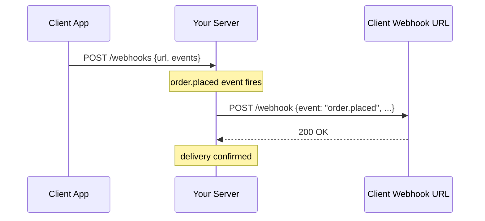

# Webhooks

[← Back to README](../README.md)

---

**Webhooks** are user-defined HTTP callbacks. Instead of polling for changes, a client registers a URL and your server POSTs event payloads to it whenever something happens. They invert the request model: the server calls the client.



---

## Webhook Registration

```java
@Entity
@Table(name = "webhook_subscriptions")
public class WebhookSubscription {

    @Id @GeneratedValue
    private UUID id;

    private String url;
    private String secret;       // HMAC signing key
    private boolean active;
    private Instant createdAt;

    @ElementCollection
    @CollectionTable(name = "webhook_events")
    private Set<String> events;  // e.g. {"order.placed", "order.shipped"}
}
```

```java
@RestController
@RequestMapping("/api/webhooks")
public class WebhookController {

    @PostMapping
    @ResponseStatus(HttpStatus.CREATED)
    public WebhookResponse register(@RequestBody @Valid RegisterWebhookRequest request,
                                    @AuthenticationPrincipal User user) {
        String secret = generateSecret();  // random 32-byte hex
        WebhookSubscription sub = webhookService.register(
            request.url(), request.events(), secret, user.getId());
        return new WebhookResponse(sub.getId(), secret);  // return secret once only
    }

    @GetMapping
    public List<WebhookSummary> list(@AuthenticationPrincipal User user) {
        return webhookService.listForUser(user.getId());
    }

    @DeleteMapping("/{id}")
    @ResponseStatus(HttpStatus.NO_CONTENT)
    public void delete(@PathVariable UUID id, @AuthenticationPrincipal User user) {
        webhookService.delete(id, user.getId());
    }
}

private String generateSecret() {
    byte[] bytes = new byte[32];
    new SecureRandom().nextBytes(bytes);
    return HexFormat.of().formatHex(bytes);
}
```

---

## Delivering Webhook Events

```java
@Service
public class WebhookDeliveryService {

    private final WebhookSubscriptionRepository subscriptions;
    private final WebhookDeliveryRepository deliveries;
    private final RestClient restClient;
    private final ObjectMapper objectMapper;

    @Async
    public void deliver(String eventType, Object payload) {
        List<WebhookSubscription> targets = subscriptions
            .findByEventsContainingAndActiveTrue(eventType);

        for (WebhookSubscription sub : targets) {
            deliverToSubscriber(sub, eventType, payload);
        }
    }

    private void deliverToSubscriber(WebhookSubscription sub,
                                      String eventType, Object payload) {
        String body;
        try {
            body = objectMapper.writeValueAsString(Map.of(
                "id",          UUID.randomUUID().toString(),
                "event",       eventType,
                "created_at",  Instant.now().toString(),
                "data",        payload));
        } catch (JsonProcessingException e) {
            throw new RuntimeException(e);
        }

        String signature = sign(body, sub.getSecret());

        WebhookDelivery delivery = new WebhookDelivery(
            sub.getId(), eventType, body, Instant.now());

        try {
            ResponseEntity<String> response = restClient.post()
                .uri(sub.getUrl())
                .contentType(MediaType.APPLICATION_JSON)
                .header("X-Webhook-Signature", "sha256=" + signature)
                .header("X-Webhook-Event",     eventType)
                .header("X-Webhook-ID",        delivery.getId().toString())
                .body(body)
                .retrieve()
                .toEntity(String.class);

            delivery.markSucceeded(response.getStatusCode().value());
        } catch (Exception e) {
            delivery.markFailed(e.getMessage());
        }

        deliveries.save(delivery);
    }
}
```

---

## HMAC Signature — Security

Sign the payload so the receiver can verify it came from you:

```java
// Signing (server → client)
public String sign(String payload, String secret) {
    try {
        Mac mac = Mac.getInstance("HmacSHA256");
        mac.init(new SecretKeySpec(secret.getBytes(StandardCharsets.UTF_8), "HmacSHA256"));
        byte[] hash = mac.doFinal(payload.getBytes(StandardCharsets.UTF_8));
        return HexFormat.of().formatHex(hash);
    } catch (Exception e) {
        throw new RuntimeException("HMAC signing failed", e);
    }
}
```

```java
// Verification (client side — receiving the webhook)
@PostMapping("/webhooks/orders")
public ResponseEntity<Void> receiveOrderEvent(
        @RequestBody String body,
        @RequestHeader("X-Webhook-Signature") String signature) {

    String expected = "sha256=" + sign(body, webhookSecret);

    // Constant-time comparison prevents timing attacks
    if (!MessageDigest.isEqual(
            expected.getBytes(),
            signature.getBytes())) {
        return ResponseEntity.status(HttpStatus.UNAUTHORIZED).build();
    }

    OrderEvent event = objectMapper.readValue(body, OrderEvent.class);
    orderEventHandler.handle(event);
    return ResponseEntity.ok().build();
}
```

---

## Retry with Exponential Backoff

Clients may be temporarily unreachable. Retry failed deliveries automatically:

```java
@Scheduled(fixedDelay = 60_000)
@Transactional
public void retryFailedDeliveries() {
    List<WebhookDelivery> failed = deliveries
        .findRetryable(Instant.now().minus(24, ChronoUnit.HOURS));

    for (WebhookDelivery delivery : failed) {
        if (delivery.getAttempts() >= 5) {
            delivery.markAbandoned();
            deliveries.save(delivery);
            continue;
        }

        // Exponential backoff: 1 min, 5 min, 30 min, 2 hr, 8 hr
        Instant nextRetry = delivery.getLastAttemptAt()
            .plus(Duration.ofMinutes((long) Math.pow(5, delivery.getAttempts())));

        if (Instant.now().isAfter(nextRetry)) {
            deliverToSubscriber(
                subscriptions.findById(delivery.getSubscriptionId()).orElseThrow(),
                delivery.getEventType(),
                objectMapper.readValue(delivery.getPayload(), Object.class));
        }
    }
}
```

---

## Webhook Delivery Log Endpoint

```java
@GetMapping("/api/webhooks/{id}/deliveries")
public Page<WebhookDeliveryResponse> getDeliveries(
        @PathVariable UUID id,
        @PageableDefault(size = 20) Pageable pageable) {
    return deliveries.findBySubscriptionId(id, pageable)
        .map(WebhookDeliveryResponse::from);
}

@PostMapping("/api/webhooks/{id}/deliveries/{deliveryId}/retry")
public ResponseEntity<Void> manualRetry(@PathVariable UUID id,
                                         @PathVariable UUID deliveryId) {
    webhookDeliveryService.retryDelivery(deliveryId);
    return ResponseEntity.accepted().build();
}
```

---

## Testing Webhooks

Use **webhook.site** (online) or run a local server during development:

```bash
# Receive webhooks locally via ngrok tunnel
ngrok http 8080

# Your public URL: https://abc123.ngrok.io
# Register it: POST /api/webhooks {"url": "https://abc123.ngrok.io/webhooks/orders", ...}
```

```java
// Integration test — verify signature and payload
@Test
void deliveredWebhookHasValidSignature() {
    // arrange — capture outgoing requests
    MockRestServiceServer server = MockRestServiceServer.bindTo(restClient).build();
    server.expect(requestTo("https://client.example.com/webhooks"))
          .andExpect(method(HttpMethod.POST))
          .andExpect(content().contentType(MediaType.APPLICATION_JSON))
          .andRespond(withSuccess());

    webhookDeliveryService.deliver("order.placed", new OrderPlacedEvent(...));

    server.verify();
}
```

---

## Webhook Design Best Practices

| Practice | Detail |
|----------|--------|
| Sign every payload | HMAC-SHA256 with a per-subscription secret |
| Constant-time comparison | `MessageDigest.isEqual()` — prevents timing attacks |
| Include delivery ID | Clients can deduplicate retried events |
| Retry with backoff | 5 attempts over 24 hours; notify user if all fail |
| Log all deliveries | Status code, attempt count, response body |
| Timeout quickly | Set read timeout to 10 s — don't wait for slow receivers |
| Secret rotation | Allow clients to rotate secrets without downtime |
| Event versioning | Include `api_version` in payload for forward compatibility |

---

## Webhook Summary

| Concept | Detail |
|---------|--------|
| Registration | Client POSTs a URL and list of event types |
| Delivery | Server POSTs event payload to the registered URL |
| HMAC signature | `X-Webhook-Signature: sha256=<hex>` header |
| Retry | Exponential backoff — 5 attempts over 24 hours |
| Idempotency | Include `id` field; clients should deduplicate |
| Delivery log | Stored per attempt — allows debugging and manual retry |

---

[← Back to README](../README.md)
