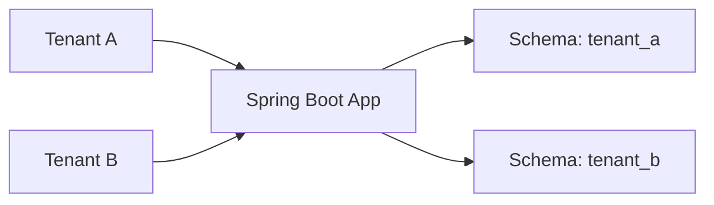

# Multi-Tenancy

[← Back to README](../README.md)

---

**Multi-tenancy** is an architecture where a single application instance serves multiple independent customers (**tenants**), keeping their data isolated. The three main strategies trade off between isolation, operational complexity, and resource efficiency.



---

## Strategy Comparison

| Strategy | Isolation | Cost | Complexity |
|----------|-----------|------|------------|
| **Separate databases** | Strongest — fully isolated | High — one DB per tenant | High |
| **Schema per tenant** | Strong — shared DB, separate schemas | Medium | Medium |
| **Discriminator column** | Weakest — shared tables | Low | Low |

---

## Strategy 1 — Discriminator Column (Simplest)

Every table has a `tenant_id` column. A Spring filter or JPA interceptor automatically applies a `WHERE tenant_id = ?` clause.

```sql
CREATE TABLE orders (
    id          UUID PRIMARY KEY,
    tenant_id   VARCHAR(50) NOT NULL,
    customer_id VARCHAR(100),
    total       DECIMAL(10,2),
    created_at  TIMESTAMPTZ DEFAULT NOW()
);

CREATE INDEX idx_orders_tenant ON orders (tenant_id);
```

### Tenant Context Holder

```java
public class TenantContext {

    private static final ThreadLocal<String> CURRENT = new ThreadLocal<>();

    public static void set(String tenantId)  { CURRENT.set(tenantId); }
    public static String get()               { return CURRENT.get(); }
    public static void clear()               { CURRENT.remove(); }
}
```

### Resolve Tenant from Request

```java
@Component
public class TenantResolutionFilter implements Filter {

    @Override
    public void doFilter(ServletRequest req, ServletResponse res,
                         FilterChain chain) throws IOException, ServletException {
        HttpServletRequest request = (HttpServletRequest) req;
        try {
            // Option 1: from subdomain  — tenant-a.example.com
            String host = request.getServerName();
            String tenantId = host.split("\\.")[0];

            // Option 2: from header
            // String tenantId = request.getHeader("X-Tenant-ID");

            // Option 3: from JWT claim
            // String tenantId = jwtUtil.extractTenantId(request);

            TenantContext.set(tenantId);
            chain.doFilter(req, res);
        } finally {
            TenantContext.clear();
        }
    }
}
```

### JPA `@Filter` — Automatic WHERE Clause

```java
@Entity
@Table(name = "orders")
@FilterDef(name = "tenantFilter",
    parameters = @ParamDef(name = "tenantId", type = String.class))
@Filter(name = "tenantFilter", condition = "tenant_id = :tenantId")
public class Order {

    @Id private UUID id;
    private String tenantId;
    // ...
}
```

```java
@Component
public class TenantFilterAspect {

    @Autowired EntityManager em;

    @Before("within(@org.springframework.stereotype.Repository *)")
    public void enableTenantFilter() {
        org.hibernate.Session session = em.unwrap(org.hibernate.Session.class);
        session.enableFilter("tenantFilter")
               .setParameter("tenantId", TenantContext.get());
    }
}
```

---

## Strategy 2 — Schema per Tenant

Each tenant gets their own database schema. Hibernate's multi-tenancy support switches schemas at connection time.

### Hibernate Multi-Tenancy Configuration

```java
@Configuration
public class MultiTenancyConfig {

    @Bean
    public LocalContainerEntityManagerFactoryBean entityManagerFactory(
            DataSource dataSource) {
        LocalContainerEntityManagerFactoryBean em =
            new LocalContainerEntityManagerFactoryBean();
        em.setDataSource(dataSource);
        em.setPackagesToScan("com.example.domain");

        HibernateJpaVendorAdapter adapter = new HibernateJpaVendorAdapter();
        em.setJpaVendorAdapter(adapter);

        Map<String, Object> props = new HashMap<>();
        props.put("hibernate.multiTenancy", "SCHEMA");
        props.put("hibernate.multi_tenant_connection_provider",
            multiTenantConnectionProvider());
        props.put("hibernate.tenant_identifier_resolver",
            currentTenantIdentifierResolver());
        em.setJpaPropertyMap(props);
        return em;
    }
}
```

```java
@Component
public class SchemaBasedConnectionProvider
        implements MultiTenantConnectionProvider<String> {

    @Autowired DataSource dataSource;

    @Override
    public Connection getAnyConnection() throws SQLException {
        return dataSource.getConnection();
    }

    @Override
    public Connection getConnection(String tenantId) throws SQLException {
        Connection conn = dataSource.getConnection();
        conn.createStatement().execute("SET search_path TO " + tenantId + ",public");
        return conn;
    }

    @Override
    public void releaseConnection(String tenantId, Connection conn) throws SQLException {
        conn.createStatement().execute("SET search_path TO public");
        conn.close();
    }
}
```

```java
@Component
public class TenantIdentifierResolver
        implements CurrentTenantIdentifierResolver<String> {

    @Override
    public String resolveCurrentTenantIdentifier() {
        String tenant = TenantContext.get();
        return tenant != null ? tenant : "public";  // fallback
    }

    @Override
    public boolean validateExistingCurrentSessions() { return true; }
}
```

### Creating a Tenant Schema

```java
@Service
public class TenantProvisioningService {

    @Autowired DataSource dataSource;
    @Autowired Flyway flyway;

    public void provisionTenant(String tenantId) {
        // Sanitise — only allow alphanumeric and underscore
        if (!tenantId.matches("[a-z0-9_]+")) {
            throw new IllegalArgumentException("Invalid tenant ID: " + tenantId);
        }

        try (Connection conn = dataSource.getConnection()) {
            conn.createStatement()
                .execute("CREATE SCHEMA IF NOT EXISTS " + tenantId);
        }

        // Run Flyway migrations against the new schema
        Flyway tenantFlyway = Flyway.configure()
            .dataSource(dataSource)
            .schemas(tenantId)
            .locations("classpath:db/migration/tenant")
            .load();
        tenantFlyway.migrate();
    }
}
```

---

## Strategy 3 — Separate Databases

Each tenant has their own database. Use a routing `DataSource` that delegates to the correct connection pool.

```java
@Bean
@Primary
public DataSource routingDataSource(TenantDataSourceRegistry registry) {
    AbstractRoutingDataSource routing = new AbstractRoutingDataSource() {
        @Override
        protected Object determineCurrentLookupKey() {
            return TenantContext.get();
        }
    };
    routing.setTargetDataSources(registry.getAll());
    routing.setDefaultTargetDataSource(registry.getDefault());
    return routing;
}
```

```java
@Component
public class TenantDataSourceRegistry {

    private final Map<Object, Object> dataSources = new ConcurrentHashMap<>();

    public void addTenant(String tenantId, DataSourceProperties props) {
        HikariDataSource ds = props.initializeDataSourceBuilder()
            .type(HikariDataSource.class)
            .build();
        ds.setPoolName("pool-" + tenantId);
        dataSources.put(tenantId, ds);
    }

    public Map<Object, Object> getAll() { return dataSources; }
}
```

---

## Tenant in Spring Security

```java
@Bean
public SecurityFilterChain securityFilterChain(HttpSecurity http) throws Exception {
    http
        .addFilterBefore(tenantResolutionFilter(), UsernamePasswordAuthenticationFilter.class)
        // ...
    return http.build();
}

// Extract tenant from JWT
@Component
public class JwtTenantFilter implements Filter {

    @Override
    public void doFilter(ServletRequest req, ServletResponse res, FilterChain chain)
            throws IOException, ServletException {
        HttpServletRequest request = (HttpServletRequest) req;
        String token = extractToken(request);
        if (token != null) {
            String tenantId = jwtUtil.extractClaim(token, "tenantId");
            TenantContext.set(tenantId);
        }
        try {
            chain.doFilter(req, res);
        } finally {
            TenantContext.clear();
        }
    }
}
```

---

## Testing Multi-Tenant Code

```java
@SpringBootTest
class OrderRepositoryMultiTenantTest {

    @Autowired OrderRepository orderRepository;

    @BeforeEach
    void setUp() { TenantContext.set("tenant_a"); }

    @AfterEach
    void tearDown() { TenantContext.clear(); }

    @Test
    void tenantACannotSeetenantBOrders() {
        // Create orders as tenant_a
        TenantContext.set("tenant_a");
        orderRepository.save(new Order("CUST-1"));

        // Switch to tenant_b — should see no orders
        TenantContext.set("tenant_b");
        assertThat(orderRepository.findAll()).isEmpty();
    }
}
```

---

## Multi-Tenancy Summary

| Concept | Detail |
|---------|--------|
| `TenantContext` | `ThreadLocal` holder for the current request's tenant ID |
| Resolution | From subdomain, header, or JWT claim |
| Discriminator | `tenant_id` column + `@Filter` — simple but weakest isolation |
| Schema per tenant | Hibernate `SCHEMA` multi-tenancy; `SET search_path` |
| Separate databases | `AbstractRoutingDataSource` per tenant |
| Provisioning | Create schema / DB + run Flyway migrations on tenant creation |
| Security | Clear `TenantContext` in `finally` to prevent leakage between requests |
| Testing | `TenantContext.set(...)` in `@BeforeEach`, verify data isolation |

---

[← Back to README](../README.md)
