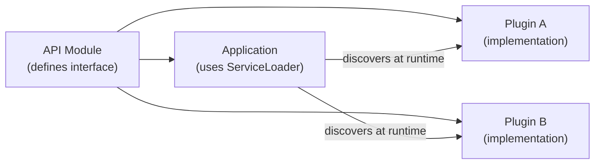

# Java ServiceLoader (SPI)

[← Back to README](../README.md)

---

The **Service Provider Interface** (SPI) pattern lets you define an interface in one module and discover implementations at runtime without a compile-time dependency on them. `java.util.ServiceLoader` is the standard JDK mechanism — used by JDBC drivers, logging backends, and many framework extension points.



---

## Defining the Service Interface

```java
// api module
public interface NotificationProvider {

    /** Unique provider name, e.g. "email", "sms", "push" */
    String name();

    boolean supports(NotificationType type);

    void send(Notification notification);
}

public record Notification(String recipient, String subject, String body) {}
public enum NotificationType { EMAIL, SMS, PUSH }
```

---

## Implementing a Provider

```java
// email-provider module — depends on api, NOT on the application
public class EmailNotificationProvider implements NotificationProvider {

    @Override
    public String name() { return "email"; }

    @Override
    public boolean supports(NotificationType type) {
        return type == NotificationType.EMAIL;
    }

    @Override
    public void send(Notification notification) {
        System.out.println("Sending email to " + notification.recipient());
    }
}
```

### Registration — Classic (`META-INF/services`)

```
# src/main/resources/META-INF/services/com.example.NotificationProvider
com.example.email.EmailNotificationProvider
com.example.sms.SmsNotificationProvider
```

Each line is the fully-qualified class name of an implementation. One file per interface.

### Registration — Module System (`module-info.java`)

```java
// In the provider module
module email.provider {
    requires api;
    provides com.example.NotificationProvider
        with com.example.email.EmailNotificationProvider;
}

// In the application module
module app {
    requires api;
    uses com.example.NotificationProvider;
}
```

---

## Loading Providers

```java
public class NotificationService {

    private final List<NotificationProvider> providers;

    public NotificationService() {
        // Discovers all implementations on the classpath / module path
        ServiceLoader<NotificationProvider> loader =
            ServiceLoader.load(NotificationProvider.class);

        providers = StreamSupport.stream(loader.spliterator(), false)
            .toList();

        System.out.println("Loaded providers: " +
            providers.stream().map(NotificationProvider::name).toList());
    }

    public void send(Notification notification, NotificationType type) {
        providers.stream()
            .filter(p -> p.supports(type))
            .findFirst()
            .orElseThrow(() -> new UnsupportedOperationException(
                "No provider for type: " + type))
            .send(notification);
    }

    // Send via all matching providers
    public void broadcast(Notification notification, NotificationType type) {
        providers.stream()
            .filter(p -> p.supports(type))
            .forEach(p -> p.send(notification));
    }
}
```

---

## Lazy Loading

`ServiceLoader` defers instantiation until the provider is accessed:

```java
ServiceLoader<NotificationProvider> loader =
    ServiceLoader.load(NotificationProvider.class);

// Lazy — only instantiates providers as needed
for (ServiceLoader.Provider<NotificationProvider> provider : loader.stream().toList()) {
    if (provider.type().getSimpleName().startsWith("Email")) {
        NotificationProvider instance = provider.get();  // instantiated here
        instance.send(notification);
    }
}
```

---

## Ordered Providers with Priority

SPI doesn't define ordering — implement it yourself:

```java
public interface NotificationProvider {
    String name();
    boolean supports(NotificationType type);
    void send(Notification notification);

    default int priority() { return 0; }  // lower = higher priority
}

// Load sorted by priority
List<NotificationProvider> providers = StreamSupport
    .stream(ServiceLoader.load(NotificationProvider.class).spliterator(), false)
    .sorted(Comparator.comparingInt(NotificationProvider::priority))
    .toList();
```

---

## Real-World Examples in the JDK

```java
// JDBC driver registration — ServiceLoader finds Driver implementations
Connection conn = DriverManager.getConnection("jdbc:postgresql://localhost/db");

// Logging backend — SLF4J uses ServiceLoader to find Logback/Log4j
LoggerFactory.getLogger(MyClass.class);

// Jackson modules — auto-registered via ServiceLoader
ObjectMapper mapper = new ObjectMapper();   // finds JDK8Module, JavaTimeModule, etc.

// Java crypto providers
Security.getProviders();   // lists all registered Provider implementations
```

---

## SPI in Spring Boot

Spring's `spring.factories` / `AutoConfiguration.imports` is the Spring equivalent of `META-INF/services`:

```
# META-INF/spring/org.springframework.boot.autoconfigure.AutoConfiguration.imports
com.example.MyAutoConfiguration
```

But you can still use plain `ServiceLoader` inside Spring beans:

```java
@Bean
public NotificationService notificationService() {
    // Mix ServiceLoader discovery with Spring's DI
    List<NotificationProvider> providers = new ArrayList<>();

    // From ServiceLoader (external JARs)
    ServiceLoader.load(NotificationProvider.class)
        .forEach(providers::add);

    return new NotificationService(providers);
}
```

---

## Testing with Custom Providers

```java
// Test provider registered in src/test/resources/META-INF/services/...
public class MockNotificationProvider implements NotificationProvider {

    private final List<Notification> sent = new ArrayList<>();

    @Override public String name()                          { return "mock"; }
    @Override public boolean supports(NotificationType t)   { return true; }
    @Override public void send(Notification n)              { sent.add(n); }

    public List<Notification> getSent() { return sent; }
}
```

```
# src/test/resources/META-INF/services/com.example.NotificationProvider
com.example.test.MockNotificationProvider
```

---

## ServiceLoader Summary

| Concept | Detail |
|---------|--------|
| SPI | Interface in one module, implementations in separate JARs |
| `META-INF/services/<interface>` | One file per interface; each line is an implementation class |
| `module-info.java` | `provides <interface> with <impl>` (provider), `uses <interface>` (consumer) |
| `ServiceLoader.load(Type.class)` | Discovers all implementations; lazy by default |
| `.stream()` | Access providers without instantiating — check type first |
| Ordering | Not guaranteed — add a `priority()` method and sort explicitly |
| Real-world use | JDBC drivers, SLF4J backends, Jackson modules, Java crypto |
| Spring equivalent | `spring.factories` / `AutoConfiguration.imports` for auto-configuration |

---

[← Back to README](../README.md)
