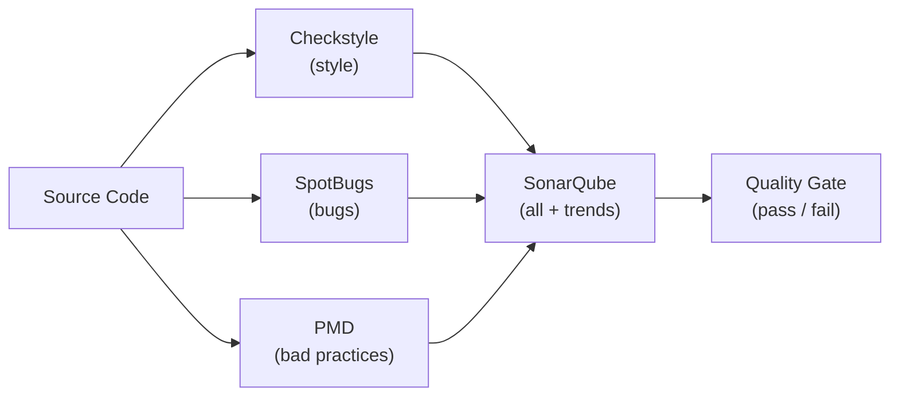

# Code Quality Tools

[← Back to README](../README.md)

---

Code quality tools catch bugs, enforce style consistency, and measure technical debt automatically — before code reaches production. They integrate into the build and CI pipeline to give every pull request an objective quality signal.



---

## Checkstyle — Style Enforcement

Checkstyle enforces coding conventions: indentation, naming, Javadoc, import order, line length.

### Maven Plugin

```xml
<plugin>
    <groupId>org.apache.maven.plugins</groupId>
    <artifactId>maven-checkstyle-plugin</artifactId>
    <version>3.4.0</version>
    <configuration>
        <configLocation>checkstyle.xml</configLocation>
        <failsOnError>true</failsOnError>
        <violationSeverity>warning</violationSeverity>
        <includeTestSourceDirectory>true</includeTestSourceDirectory>
    </configuration>
    <executions>
        <execution>
            <goals><goal>check</goal></goals>
            <phase>validate</phase>
        </execution>
    </executions>
</plugin>
```

### `checkstyle.xml`

```xml
<?xml version="1.0"?>
<!DOCTYPE module PUBLIC
    "-//Checkstyle//DTD Checkstyle Configuration 1.3//EN"
    "https://checkstyle.org/dtds/configuration_1_3.dtd">

<module name="Checker">
    <property name="severity" value="warning"/>

    <module name="FileTabCharacter"/>           <!-- no tabs -->
    <module name="NewlineAtEndOfFile"/>

    <module name="TreeWalker">
        <!-- Naming conventions -->
        <module name="TypeName"/>              <!-- PascalCase for classes -->
        <module name="MethodName"/>            <!-- camelCase for methods -->
        <module name="ConstantName"/>          <!-- UPPER_SNAKE for constants -->
        <module name="LocalVariableName"/>

        <!-- Code style -->
        <module name="LineLength">
            <property name="max" value="120"/>
        </module>
        <module name="LeftCurly"/>             <!-- { on same line -->
        <module name="NeedBraces"/>            <!-- braces always required -->
        <module name="WhitespaceAround"/>

        <!-- Imports -->
        <module name="AvoidStarImport"/>       <!-- no wildcard imports -->
        <module name="UnusedImports"/>

        <!-- Javadoc -->
        <module name="MissingJavadocMethod">
            <property name="scope" value="public"/>
        </module>
    </module>
</module>
```

```bash
mvn checkstyle:check
```

---

## SpotBugs — Bug Detection

SpotBugs performs static analysis to find real bugs: null dereferences, resource leaks, incorrect synchronisation, SQL injection, and more.

### Maven Plugin

```xml
<plugin>
    <groupId>com.github.spotbugs</groupId>
    <artifactId>spotbugs-maven-plugin</artifactId>
    <version>4.8.6.2</version>
    <configuration>
        <effort>Max</effort>
        <threshold>Medium</threshold>    <!-- Low | Medium | High -->
        <failOnError>true</failOnError>
        <excludeFilterFile>spotbugs-exclude.xml</excludeFilterFile>
        <plugins>
            <!-- Find Security Bugs — OWASP-focused checks -->
            <plugin>
                <groupId>com.h3xstream.findsecbugs</groupId>
                <artifactId>findsecbugs-plugin</artifactId>
                <version>1.13.0</version>
            </plugin>
        </plugins>
    </configuration>
    <executions>
        <execution>
            <goals><goal>check</goal></goals>
            <phase>verify</phase>
        </execution>
    </executions>
</plugin>
```

### Suppressing False Positives

```java
// Suppress a specific bug pattern
@SuppressFBWarnings(value = "NP_NULL_ON_SOME_PATH",
                    justification = "Null checked above via Objects.requireNonNull")
public void process(String input) { ... }
```

```xml
<!-- spotbugs-exclude.xml -->
<FindBugsFilter>
    <!-- Exclude generated code -->
    <Match>
        <Package name="~com\.example\.generated\..*"/>
    </Match>
    <!-- Exclude a specific class -->
    <Match>
        <Class name="com.example.legacy.OldController"/>
        <Bug pattern="SQL_INJECTION_JDBC"/>
    </Match>
</FindBugsFilter>
```

```bash
mvn spotbugs:check
mvn spotbugs:gui     # open the visual bug viewer
```

---

## PMD — Bad Practices

PMD catches code smells: overly complex methods, too-large classes, unused variables, empty catch blocks, copy-paste violations.

### Maven Plugin

```xml
<plugin>
    <groupId>org.apache.maven.plugins</groupId>
    <artifactId>maven-pmd-plugin</artifactId>
    <version>3.24.0</version>
    <configuration>
        <rulesets>
            <ruleset>/rulesets/java/maven-pmd-plugin-default.xml</ruleset>
            <ruleset>pmd-rules.xml</ruleset>
        </rulesets>
        <failOnViolation>true</failOnViolation>
        <printFailingErrors>true</printFailingErrors>
        <minimumTokens>100</minimumTokens>    <!-- CPD: min tokens for duplication -->
    </configuration>
    <executions>
        <execution>
            <goals>
                <goal>check</goal>
                <goal>cpd-check</goal>    <!-- copy-paste detector -->
            </goals>
        </execution>
    </executions>
</plugin>
```

### Custom Rule Set (`pmd-rules.xml`)

```xml
<?xml version="1.0"?>
<ruleset name="Custom Rules"
    xmlns="http://pmd.sourceforge.net/ruleset/2.0.0">

    <description>Project-specific PMD rules</description>

    <rule ref="category/java/bestpractices.xml/UnusedLocalVariable"/>
    <rule ref="category/java/bestpractices.xml/UnusedPrivateField"/>
    <rule ref="category/java/errorprone.xml/EmptyCatchBlock"/>
    <rule ref="category/java/errorprone.xml/CloseResource"/>
    <rule ref="category/java/design.xml/CyclomaticComplexity">
        <properties>
            <property name="methodReportLevel" value="10"/>
        </properties>
    </rule>
    <rule ref="category/java/design.xml/TooManyMethods">
        <properties>
            <property name="maxmethods" value="20"/>
        </properties>
    </rule>
</ruleset>
```

---

## SonarQube — Unified Analysis + Trends

SonarQube aggregates Checkstyle, SpotBugs, PMD, and its own rules into a single dashboard with quality gates and historical trends.

### Running SonarQube Locally

```yaml
# compose.yml
services:
  sonarqube:
    image: sonarqube:10-community
    ports:
      - "9000:9000"
    environment:
      SONAR_ES_BOOTSTRAP_CHECKS_DISABLE: true
    volumes:
      - sonar-data:/opt/sonarqube/data
      - sonar-logs:/opt/sonarqube/logs

volumes:
  sonar-data:
  sonar-logs:
```

### Maven Scanner

```xml
<plugin>
    <groupId>org.sonarsource.scanner.maven</groupId>
    <artifactId>sonar-maven-plugin</artifactId>
    <version>4.0.0.4121</version>
</plugin>
```

```bash
mvn verify sonar:sonar \
  -Dsonar.projectKey=order-service \
  -Dsonar.host.url=http://localhost:9000 \
  -Dsonar.token=${SONAR_TOKEN}
```

### `sonar-project.properties`

```properties
sonar.projectKey=order-service
sonar.projectName=Order Service
sonar.sources=src/main/java
sonar.tests=src/test/java
sonar.java.binaries=target/classes
sonar.coverage.jacoco.xmlReportPaths=target/site/jacoco/jacoco.xml
sonar.exclusions=**/generated/**,**/*Config.java
```

---

## JaCoCo — Code Coverage

```xml
<plugin>
    <groupId>org.jacoco</groupId>
    <artifactId>jacoco-maven-plugin</artifactId>
    <version>0.8.12</version>
    <executions>
        <execution>
            <goals><goal>prepare-agent</goal></goals>
        </execution>
        <execution>
            <id>report</id>
            <phase>verify</phase>
            <goals><goal>report</goal></goals>
        </execution>
        <!-- Fail build if coverage drops below threshold -->
        <execution>
            <id>check</id>
            <goals><goal>check</goal></goals>
            <configuration>
                <rules>
                    <rule>
                        <element>BUNDLE</element>
                        <limits>
                            <limit>
                                <counter>LINE</counter>
                                <value>COVEREDRATIO</value>
                                <minimum>0.80</minimum>   <!-- 80% line coverage -->
                            </limit>
                            <limit>
                                <counter>BRANCH</counter>
                                <value>COVEREDRATIO</value>
                                <minimum>0.70</minimum>
                            </limit>
                        </limits>
                    </rule>
                </rules>
            </configuration>
        </execution>
    </executions>
</plugin>
```

---

## CI Integration (GitHub Actions)

```yaml
# .github/workflows/quality.yml
name: Code Quality

on: [push, pull_request]

jobs:
  quality:
    runs-on: ubuntu-latest
    steps:
      - uses: actions/checkout@v4
        with:
          fetch-depth: 0   # SonarQube needs full history

      - uses: actions/setup-java@v4
        with:
          java-version: '21'
          distribution: 'temurin'

      - name: Build and analyse
        env:
          SONAR_TOKEN: ${{ secrets.SONAR_TOKEN }}
        run: |
          mvn verify sonar:sonar \
            -Dsonar.projectKey=order-service \
            -Dsonar.host.url=${{ secrets.SONAR_HOST_URL }} \
            -Dsonar.token=${{ env.SONAR_TOKEN }}
```

---

## Quality Gate

A **Quality Gate** is a set of pass/fail conditions. Default SonarQube gate:

| Metric | Condition |
|--------|-----------|
| New Bugs | 0 |
| New Vulnerabilities | 0 |
| New Code Smells | — |
| New Coverage | ≥ 80% |
| New Duplication | ≤ 3% |

The CI job fails if the quality gate is not met — blocking the PR merge.

---

## Code Quality Summary

| Tool | What It Catches | Run With |
|------|----------------|---------|
| Checkstyle | Style, naming, formatting | `mvn checkstyle:check` |
| SpotBugs | Null dereferences, resource leaks, concurrency bugs | `mvn spotbugs:check` |
| Find Security Bugs | SQL injection, XSS, weak crypto | SpotBugs plugin |
| PMD | Complexity, unused vars, empty catch, duplicates | `mvn pmd:check` |
| JaCoCo | Line / branch coverage report and gate | `mvn verify` |
| SonarQube | Aggregates all + trends + quality gate | `mvn sonar:sonar` |

---

[← Back to README](../README.md)
